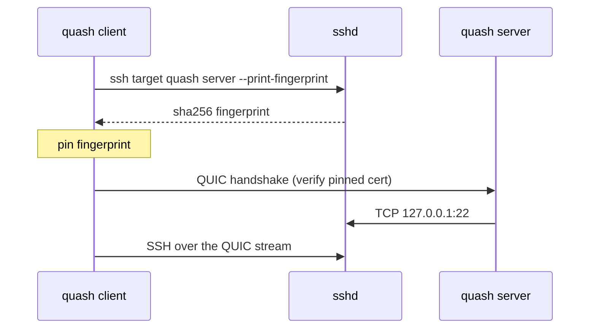

# quash

QUIC transport for SSH. `quash` is a thin drop-in shim: it does not reimplement
SSH. Instead it carries the SSH byte stream over QUIC so that OpenSSH,
`scp`, `git`, and VS Code Remote all inherit QUIC's connection migration
without changing the client or the server.

The name is QUIC + SSH, and it reads like the English word *quash*.

## Design

Authentication follows the SSH-bootstrapped model. The QUIC layer does not add
its own authentication; it relies on the end-to-end SSH handshake for
identity and confidentiality. To protect against a man in the middle on the
first contact, the client fetches the server certificate fingerprint over an
authenticated SSH channel and pins it for the QUIC handshake.



The SSH login is end-to-end. Even if the QUIC transport were compromised, the
SSH handshake and MACs still protect the session.

## Usage

Server:

```
quash server --listen 0.0.0.0:4433 --proxy-to 127.0.0.1:22
```

Client as an SSH ProxyCommand:

```
Host example.com
    ProxyCommand quash client --remote %h:4433 --ssh-target %r@%h
```

The client runs `ssh -o ProxyCommand=none` to fetch the fingerprint, so the
bootstrap does not recurse into the same ProxyCommand.

To skip the bootstrap and pin a fingerprint directly:

```
quash client --remote example.com:4433 --fingerprint <64 hex chars>
```

## Scope

This is an early prototype. It does not yet implement TCP fallback, keepalive
tuning, or certificate rotation. The QUIC hop appears to SSH exactly like a
TCP socket, so host key management continues to work through `known_hosts`.
